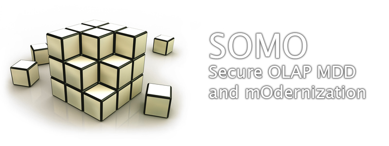

**SOMO** is focused on the development and modernization of data warehouses and OLAP applications by including security aspects. It uses the model driven approach defining models for different development stages (conceptual and logical design) and a set of transformations that allow to automate code generation and modernization processes.

## METAMODELS

- Conceptual Metamodel (EMF and GMF)
- Logical Metamodel (EMF and GMF)
  [Download](SOMOMetamodels.zip) 

  ​     
## CODE GENERATION
- Transformation from Conceptual to Logical Model (QVT rules)
- Transformation from Logical Model to SQL Server Analysis Services (MOFScript rules)
  [Download](SOMOSourceCodeMDD.zip)

## MODERNIZATION
- Transformation from SQL Server Analysis Services to Logical Model (Java program)
- Transformation from Logical to Conceptual Model (QVT rules)
  [Download](SOMOSourceCodeModernization.zip)

## EXAMPLES
- Modernization example by using a small Hospital DW
- A legacy SQL Server Analysis Services implementation
- Logical and Conceptual Model
  [Download](SOMOHospitalExample.zip)
      
### TOOLS
These tools are needed for modeling and running the transformations.

- [Eclipse Modeling Tools](http://www.eclipse.org/downloads/packages/eclipse-modeling-tools/indigor) for modeling (EMF and GMF) and running model to text transformations (MOFScript rules).

- [Medini QVT](http://projects.ikv.de/qvt/) for running model to model transformations (QVT rules).